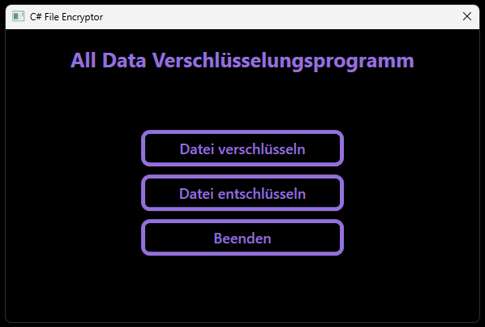

# AegisCrypt - Advanced File Encryptor

> **Note:** Soon I'll be program my own algorithm that's why I was firstly using AES.

## About the Program
The **CS-FileEncryptor** is a WPF-based tool for securely encrypting and decrypting files. With a user-friendly interface and strong implementation, this program offers:

- **AES encryption** for secure file storage.
- Easy file selection through the graphical interface (no manual path needed).
- Protection against wrong passwords: After 5 failed attempts, the encrypted file is permanently deleted.
- Error and success messages to keep users informed about what happened.

> **Note:** The program requires a 16-character password. Make sure to save it, as it is needed for decryption.

---

## Features
- **Encryption**: Securely encrypt files with AES.
- **Decryption**: Only decrypt files with the correct password.
- **User-Friendly Interface**: Buttons with animations for a better experience.
- **Error Handling**: Shows clear error messages and avoids crashes.

---

## Installation
1. Go to the [Releases](#).
2. Download the latest `.exe` file.
3. Run the program directly, no installation required.

---

## How It Works (Code Overview)

### Encryption
The `EncryptFile` method uses AES to securely encrypt a file:
- **Key**: The first 16 characters of the entered password.
- **IV**: Initialization Vector is set to 16 zeros by default.
- The original file is deleted after successful encryption.

### Decryption
The `DecryptFile` method decrypts the file with the correct password:
- **Attempt Limit**: After 5 wrong attempts, the file is deleted.
- **Error Messages**: Alerts the user if the password is incorrect.

### Key Components
- **File Selection**: `PromptFilePath` opens a dialog for easy file selection.
- **Password Input**: `PromptPassword` asks the user to enter a password.
- **Notifications**: `ShowSuccessMessage` and `ShowErrorWindow` inform the user about the action status.

---

## Requirements
No special requirements. Just download and run the program.

---

## License
License free. This program can be used freely.
